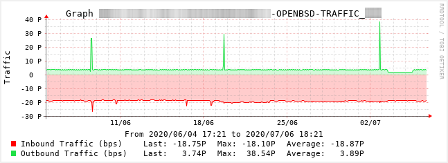

[](https://github.com/alexander-naumov/openbsd_snmp3_check/LICENSE)
[](https://app.travis-ci.com/github/alexander-naumov/openbsd_snmp3_check)


This script checks memory and swap usage, file system space usage,
traffic for specific network interface and CPU load average on OpenBSD
systems and can be used as a plugin with such monitoring systems
like Nagios/Icinga/Centreon and others.

It also shows detailed information about all avaliable file systems,
configured NICs, system information about OS and list of running processes.

It runs on GNU/Linux and OpenBSD systems and can use **snmpwalk(1)** or
native **snmp(1)** client as a backend. There is also version (unsupportet)
that uses EasySNMP Python3 library as a backend.

Tested on OpenBSD 7.2.

```
> ./openbsd_snmp3.py -h
usage: openbsd_snmp3.py [-h] [--version] -H HOST [-p PORT] [-b BACKEND] [-t TIMEOUT]
                        [-r RETRY] -l SECLEVEL -u SECNAME [-a AUTHPROTOCOL]
                        [-A AUTHPASSWORD] [-x PRIVPROTOCOL] [-X PRIVPASSWORD]
                        -O OPTION [-w WARNING] [-c CRITICAL]
optional arguments:
  -h, --help       show this help message and exit
  -d, --debug      Enable debugging mode
  --version        show program's version number and exit
  -H HOST          IP addess (IPv4 and IPv6 supported) or hostname of the target host
  -p PORT          UDP port used for the establishing SNMPv3 connection (default 161)
  -b BACKEND       SNMP client. snmpwalk(1) and snmp(1) (native OpenBSD client) are
                   supported (default 'snmpwalk')
  -t TIMEOUT       Timeout in seconds (default 1)
  -r RETRY         Number of connection retries (default 3)
  -l SECLEVEL      Set the securityLevel used for SNMPv3 messages
                   (noAuthNoPriv|authNoPriv|authPriv).
  -u SECNAME       Set the securityName used for authenticated SNMPv3
                   messages.
  -a AUTHPROTOCOL  Set the authentication protocol (MD5|SHA) used for
                   authenticated SNMPv3 messages.
  -A AUTHPASSWORD  Set the authentication pass phrase used for authenticated
                   SNMPv3 messages.
  -x PRIVPROTOCOL  Set the privacy protocol (DES|AES) used for encrypted
                   SNMPv3 messages.
  -X PRIVPASSWORD  Set the privacy pass phrase used for encrypted SNMPv3
                   messages.
  -O OPTION        Check target. This can be "cpu", "mem", "swap", "fs" or
                   "proc" - number of running processes. Use "os" to see
                   operation system information, "proc" to see table of
                   running processes, "interfaces" to see statistics about
                   installed network interfaces and traffic, "file-systems" to
                   see the statistic of disk usage on all mounted file
                   systems.
  -w WARNING       WARNING threshold
  -c CRITICAL      CRITICAL threshold

      _____                 ____   _____ _____        _____ _   _ __  __ _____       ____
     / ___ \               |  _ \ / ____|  __ \      / ____| \ | |  \/  |  __ \     |___ \
    / /  / /___  ___  ____ | |_) | (___ | |  | |    | (___ |  \| | \  / | |__) |_   ____) |
   / /  / / __ \/ _ \/ __ \|  _ < \___ \| |  | |     \___ \| . ` | |\/| |  ___/\ \ / /__ <
  / /__/ / /_/ /  __/ / / /| |_) |____) | |__| |     ____) | |\  | |  | | |     \ V /___) |
  \_____/ .___/\___/_/ /_/ |____/|_____/|_____/     |_____/|_| \_|_|  |_|_|      \_/|____/
       /_/
              |    .
          .   |L  /|   .       This script uses SNMPv3 to check memory/swap usage, file system
      _ . |\ _| \--+._/| .      space usage and CPU load average on (remote) OpenBSD system.
     / ||\| Y J  )   / |/| ./    It also shows detailed information about all avaliable file
    J  |)'( |        ` F`.'/     systems, configured NICs, system information about OS
  -<|  F         __     .-<       and list of running processes.
    | /       .-'. `.  /-. L___
    J \      <    \  | | O\|.-'                           EXAMPLES:
  _J \  .-    \/ O | | \  |F
 '-F  -<_.     \   .-'  `-' L__  Checks FS space usage (in %) on '/var' with 'authPriv' secLevel:
__J  _   _.     >-'  )._.   |-'  > ./openbsd_snmp3.py -H <IP_ADDRESS> -u <secName> -A <authPassword>
`-|.'   /_.           \_|   F     -a <authProtocol> -X <privPassword> -x <privProtocol> -l authPriv
  /.-   .                _.<      -O fs:/var -w 80 -c 90
 /'    /.'             .'  `\
  /L  /'   |/      _.-'-\      Checks RAM usage (in %) with 'authNoPriv' secLevel:
 /'J       ___.---'\|         > ./openbsd_snmp3.py -u <secName> -A <authPassword> -a <authProtocol>
   |\  .--' V  | `. `           -l authNoPriv -H <IP_ADDRESS> -O mem -w 60 -c 90
   |/`. `-.     `._)
      / .-.\                Checks SWAP usage (in %) with 'noAuthNoPriv' secLevel:
      \ (  `\                > ./openbsd_snmp3.py -u <secName> -l noAuthNoPriv -H <IP_ADDRESS>
       `.\                      -O swap -w 60 -c 90


```
Show short statistics about installed network interfaces. In this case snmp(1) client used:

```
> ./openbsd_snmp3.py -b snmp -u snmpv3 -A authauthkey -a SHA -X encenckey -x AES -l authPriv \
-H 192.168.3.2 -O interfaces

NAME       STATE         IP                 MAC                  MTU        TYPE            I/O ERROR
=====================================================================================================
em0        active        192.168.3.2        00:0B:AB:B9:56:4F    1500       Ethernet           0/0
em1        no carrier    ---------------    00:0B:AB:B9:56:50    1500       Ethernet           0/0
em2        no carrier    ---------------    00:0B:AB:B9:56:51    1500       Ethernet           0/0
em3        no carrier    ---------------    00:0B:AB:B9:56:52    1500       Ethernet           0/0
enc0       no carrier    ---------------                         0          Other              0/0
lo0        active        127.0.0.1                               32768      Loopback           0/0
pflog0     active        ---------------                         33136      Other              0/0

```

Monitor **traffic** (bandwidth for full-duplex connections) on specific network interface:

```
> ./openbsd_snmp3.py -u snmpv3 -A aUthkeySNMP -a SHA -X eNckeySNMP -x AES -l authPriv \
-H 192.168.3.109 -O traffic:urtwn0
Could not read cache file. Creating new cache... please try again in 5 mins

```

Because MIB-II variables are stored as counters, script must take two poll cycles and
figure the difference between the two (hence, the delta used in the equation).
New file will be created and will be used to store this data.
In my case this is /tmp/traffic.192.168.3.109.urtwn0.

Right now 5 mins cycles only is supported. So, by running this script each 5 mins we will
get output like this:

```
> ./openbsd_snmp3.py -u snmpv3 -A aUthkeySNMP -a SHA -X eNckeySNMP -x AES -l authPriv \
-H 192.168.3.109 -O traffic:urtwn0
Interface 'urtwn0' - Traffic In: 69350400000000.01bps, Traffic Out: 32029200000000.004bps | 'traffic_in'=69350400000000.01bps;;;0; 'traffic_out'=32029200000000.004bps;;;0;

```

By configuring monitoring system to use traffic graphs for this check/service, graph like
this could be created:




List of mounted **file systems** and its free space usage:

```
> ./openbsd_snmp3.py -H 192.168.122.241 -u snmpv3 -l authPriv -A aUthkeySNMP -a SHA \
-X eNckeySNMP -x AES -O file-systems

    SIZE		USED		    AVALIABLE		FILE SYSTEM
==================================================================================
  654.0 Mb	   54.5 Mb (8.34 %)	  599.5 Mb (91.66 %)	/
    4.4 Gb	    7.4 Mb (0.16 %)	    4.4 Gb (99.84 %)	/home
  927.3 Mb	   12.0 Kb (0.00 %)	  927.3 Mb (100.00 %)	/tmp
    1.4 Gb	  701.6 Mb (50.39 %)	  690.6 Mb (49.61 %)	/usr
  679.0 Mb	  186.2 Mb (27.42 %)	  492.9 Mb (72.58 %)	/usr/X11R6
    2.5 Gb	   67.0 Mb (2.65 %)	    2.4 Gb (97.35 %)	/usr/local
    5.3 Gb	    2.0 Kb (0.00 %)	    5.3 Gb (100.00 %)	/usr/obj
    1.4 Gb	    2.0 Kb (0.00 %)	    1.4 Gb (100.00 %)	/usr/src
    1.4 Gb	    8.0 Mb (0.57 %)	    1.4 Gb (99.43 %)	/var

```

Check **free space usage** on /usr/X11R6 file system (using warning and critical
thresholds by 80% and 90%)

```
> ./openbsd_snmp3.py -H 192.168.122.241 -u snmpv3 -l authPriv -A aUthkeySNMP -a SHA \
-X eNckeySNMP -x AES -O fs:/usr/X11R6 -w 80 -c 90
OK: FS usage: 27.42 % [ 186.2 Mb / 679.0 Mb ]|usage=27.42;80;90;0;0

> echo $?
0
```

By setting waring thresholds to 20% output string chages to WARNING and return
code is now 1

```
> ./openbsd_snmp3.py -H 192.168.122.241 -u snmpv3 -l authPriv -A aUthkeySNMP -a SHA \
-X eNckeySNMP -x AES -O fs:/usr/X11R6 -w 20 -c 90
WARNING: FS usage: 27.42 % [ 186.2 Mb / 679.0 Mb ]|usage=27.42;20;90;0;0

> echo $?
1
```

Check **SWAP usage**:

```
> ./openbsd_snmp3.py -H 192.168.122.241 -u snmpv3 -l authPriv -A aUthkeySNMP -a SHA \
-X eNckeySNMP -x AES -O swap -w 80 -c 90
OK: Swap space usage: 0.00 % [ 0.0 b / 1.1 Gb ]|usage=0.00;80;90;0;0
```

Check **RAM usage**:
```
> ./openbsd_snmp3.py -H 192.168.122.241 -u snmpv3 -l authPriv -A aUthkeySNMP -a SHA \
-X eNckeySNMP -x AES -O mem -w 80 -c 90
OK: Real memory usage: 36.09 % [ 363.8 Mb / 1007.9 Mb ]|usage=36.09;80;90;0;0
```

Check **number of running processes**:
```
> ./openbsd_snmp3.py -H 192.168.122.241 -u snmpv3 -l authPriv -A aUthkeySNMP -a SHA \
-X eNckeySNMP -x AES -O proc -w 80 -c 90
OK: running 42 processes [max 1310]|processes=42;80;90;0;0
```

Check **CPU load average**:
```
> ./openbsd_snmp3.py -H 192.168.122.241 -u snmpv3 -l authPriv -A aUthkeySNMP -a SHA \
-X eNckeySNMP -x AES -O cpu -w 40 -c 60
OK: CPU load average 1 |'1 min'=1;40;60;0;0
```

Show **system information** about mashine. System has uptime 6 hours 52 mins.

```
> ./openbsd_snmp3.py -u snmpv3 -A aUthkeySNMP -a SHA -X eNckeySNMP -x AES -l authPriv \
-H 192.168.3.109 -O os

System:  OpenBSD softiron 6.7 GENERIC.MP#602 arm64
Uptime:  6:52:29.16
CPU:     ARM Cortex-A57 r1p2
Contact: root@softiron

```

In case of error it shows first stderr line returned by backend:

```
> ./openbsd_snmp3.py -u snmpv3 -A <pwd> -a SHA -X <pwd> -x AES -l authPriv -H 192.168.4.1 -O os
Can't get such information...
snmpwalk: Timeout (Sub-id not found: (top) -> sysDescr)
```

Option ```-d``` makes it more verbose. It enables debugging mode.
In that case user can see the full error message (from backend)
